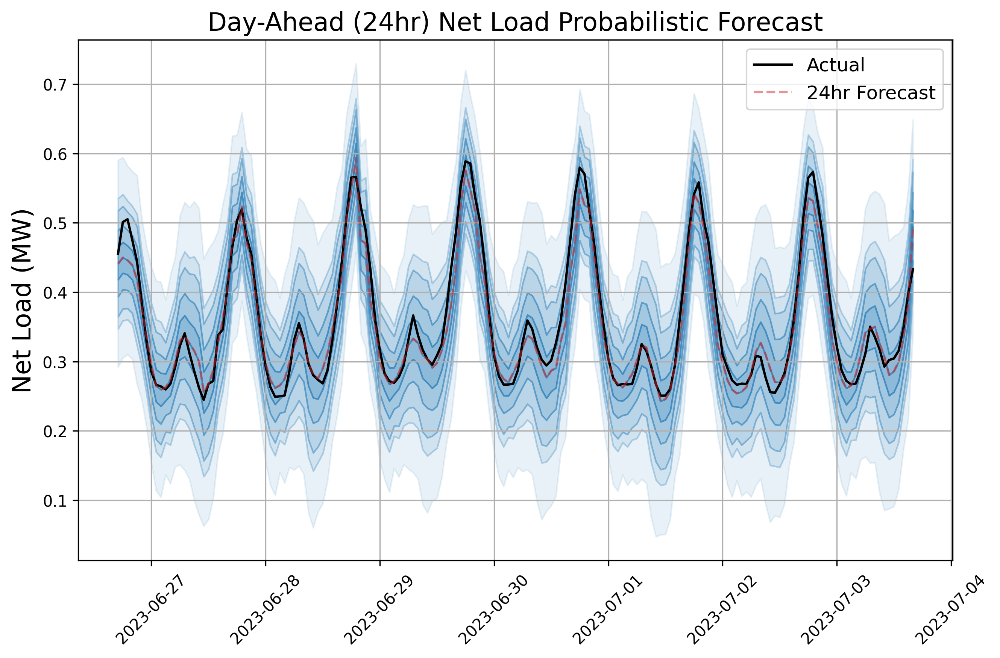

# Probabilistic_net_load_forecast
A probabilistic forecast using 3-layer Neural Network with RLU layers for non-linear function approximation.


An example forecast is provided below:


## Dependencies
```
$ python -m venv env
$ source env/bin/activate
$ pip install -r requirements.txt
```

## Usage
```
Train a model for the Georga Substation:
$ python nlf_nn.py -s GA -tr   

Plot the forecast:
$ python nlf_nn.py -s GA --plot

Create a forecast:
$ python nlf_nn.py -s GA -cf

Upload a forecast:
$ python nlf_nn.py --upload-forecast --file data/forecast.nn_point.20230711_094825.90c2a42c-f0ad-11ed-94b4-5edf5e2b3336.csv
```